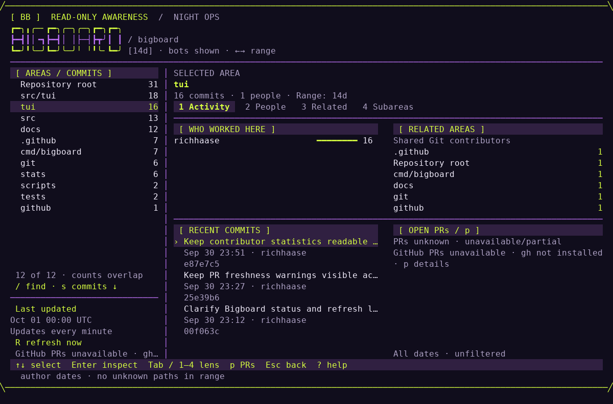

# Big Board

A terminal situational-awareness board for seeing who has worked where across your Git repositories, how that work connects, and the commits behind it. Inspired by Hiro Protagonist's Big Board from Neal Stephenson's *Snow Crash*.



*The Night Ops workspace, showing Bigboard's own public Git history at 120 × 36.
Select a work area to see who worked there and the commits behind it. PR data is
unavailable in this capture; unknown is not zero. The pictured “Updates every
minute” label is historical; current Bigboard refreshes only on launch or `R`.*

[Take the visual tour](docs/visual-guide.md) for the views, navigation, and how to
read the counts. [Controls](#controls) · [Configuration](#config-file) ·
[GitHub PR context](#automatic-github-pr-awareness)

## Install

Big Board requires Git 2.31 or newer on `PATH`. Partial clones require Git
2.45.1 or newer so scans can reliably disable automatic object fetching.

### Homebrew

```bash
brew install --cask richhaase/tap/bigboard
```

### From Source

```bash
go install github.com/richhaase/bigboard/cmd/bigboard@latest
```

## Usage

Big Board is TUI-first: preferences live in the config file, and the CLI has exactly four flags.

```bash
# Analyze current directory
bigboard

# Analyze specific repos or scan directories for repos
bigboard ~/src/repo1 ~/src/repo2
bigboard ~/src/

# Use a named group from your config
bigboard --group backend

# Print contributor stats as JSON and exit (all-time window)
bigboard --export ~/src/ > board.json

# Use an alternate config file
bigboard --config ./bigboard.json

# Print version and exit
bigboard --version
```

The time range is chosen interactively (`←/→`) and defaults to 14 days. Set
`since` in the config to choose the initial range. `--export` always covers
all time; per-contributor first/last commit dates are included for reference.
Those dates alone cannot reconstruct totals for a narrower time window.

## Work relationships

Night Ops is a Go/Bubble Tea workspace with a dark violet canvas, acid-lime
selection and compact outlined wordmark. At 100 columns × 28 rows and above,
the repository/area inventory stays on the left while the selected scope shows
ranked contributors and related areas above recent commits and PR context.
Moving the selection updates this evidence immediately. The default Activity
sort exposes where commits are concentrated; `s` switches to Recent or Name
without changing the selected identity. Commit volume is not priority or productivity.
Contributor previews use the current time range and bot filter, ranked by commits
in this scope; a bounded preview shows `+N more` when needed. The full alphabetical
list remains in People. Repository previews show their busiest work areas.

Press `Enter` on a repository to open its work areas. A single included repository
opens directly into work areas after scanning. `Enter` on an area opens a dedicated
detail view, moving keyboard focus from the sidebar into the selected lens.
`Tab` or `1`–`4` also opens a lens directly from the area inventory. In detail,
`Tab` / `Shift+Tab` or `1`–`4` switches Activity, People, Related, and Subareas;
only one detail surface is expanded at a time. Activity shows real subjects with
author-date evidence (day headings in the compact view). `Enter` opens a scrollable inspector with the
full subject, canonical contributor identity, timestamp, object ID, and all changed
paths. People is alphabetical; selecting a person filters Activity. Related lists
exact shared-contributor counts; open one to inspect those identities and their
evidence. These are historical associations, including shared Git history across
clones or forks, not online presence or proof of collaboration.

Subareas refines automatic path areas by one literal directory level at a time.
Direct files are a separate leaf; multi-path commits can appear in several children.
Configured named areas keep their explicit meaning and are not automatically
reinterpreted. `Esc` returns through each level, restoring the prior selection.
`/` searches the current list, `Enter` accepts the query, and `Esc` clears it before
leaving. `?` shows all controls. `v` switches to contributor statistics. Time ranges,
bot hiding, repository inclusion, and manual refresh apply to both views.

Work areas are path-based groups, not inferred features or ownership. Automatic
grouping expands containers such as `src`, `services`, `packages`, `apps`, `cmd`,
and `internal`, so `services/auth` and `services/payments` appear separately.
Definitions use the full scan and stay stable while changing the time range.
Root files, excluded-file-only commits, empty commits, and unknown shallow-boundary
paths have explicit groups. Binary files count as activity even without line counts.
A commit can appear in several areas; area counts overlap and must not be summed.
Only destination paths assign rename/copy pairs to areas; the previous path is
shown as evidence, without treating an unchanged copy source as work.

For meaningful cross-directory groups, optionally configure `work_areas`:

```json
{
  "work_areas": {
    "my-monorepo": [
      {"name": "Authentication", "paths": ["services/auth", "apps/web/src/auth"]},
      {"name": "Payments", "paths": ["services/payments"]}
    ]
  }
}
```

The repository key is its unique display name or absolute path (absolute path
wins). Prefixes are literal repository-relative files or directories, not globs.
The longest matching prefix wins; unmatched paths keep automatic groups. Names
must be unique within a repository, and one prefix cannot name two areas.
The existing `depth` setting still controls repository discovery only.

The board updates local repository data only on launch and when you press `R`.
There is no periodic auto-refresh. “Last updated” shows the last successful local
refresh for the selected repository; “Updating…” keeps the existing view usable during a refresh. `R`
refreshes local history immediately and requests GitHub PR context subject to
the remote cooldown described below. Big Board never runs `git fetch`;
fetch remote history separately when you want to update your local Git cache.
A failed refresh retains that repository's last successful data with
a STALE marker; a successful scan, including an empty one, replaces it. The board
requires at least 40 columns by 18 rows. Narrow or short terminals keep one primary
surface with a compact Night Ops header and the same controls. Overview rows retain numeric context instead of
listing every contributor inline; detail and commit inspection preserve the full
evidence. Shallow, stale, failed, partial, and unknown data remain visibly qualified.
Statistics retain their wide layout; narrow contributor detail uses labeled
repository metrics so every value remains readable. On short terminals, contributor detail
uses `PgUp` / `PgDn` to scroll and `Home` / `End` for the first or last page;
`↑` / `↓` still switches contributors. Its navigation remains visible while
scrolling through the timeline and activity matrix.

## Automatic GitHub PR awareness

Read-only open pull request context loads automatically for supported GitHub
origins using an already installed and signed-in `gh` CLI. No config setting is
needed.
Missing `gh` or authentication is shown without blocking local history. Bigboard
never signs in, requests access, creates credentials, fetches Git objects, or
changes pull requests. Headless `--export` stays local and unchanged.
Only a supported GitHub `origin` is used, with no upstream guessing.

PR counts appear beside Repositories and Work areas. Press `p` for the selected
scope or `P` for all included repositories, then Enter for a scrollable detail view
and Esc to return. Details show the canonical link, GitHub author and reviewers,
aggregate review decision, check rollup, mergeability and update time. GitHub
handles remain separate from local Git contributor identities. `UNKNOWN` is not
approval or merge readiness; “updated” includes any PR activity.

Changed file paths map to the same configured prefixes and automatic Work areas
as local history, including new PR-only areas. Generated files follow `all_files`.
A PR touching multiple areas appears in each; the overall count deduplicates it,
including across duplicate local clones. PRs remain independent of local date,
contributor and bot filters and never enter commit totals or the JSON export.

The initial remote refresh runs after the local scan without blocking navigation.
`R` refreshes local history and PR context; inside the PR overlay it refreshes PRs
only. Repeated refreshes reuse in-memory snapshots for at least one minute and
join an in-flight remote refresh rather than canceling and restarting it. Excluded
repositories are not fetched. The entire remote refresh shares a 128-request cap;
repositories left unfetched retain explicitly stale/partial evidence. Rate limits
pause all remaining requests, honor GitHub's reset/Retry-After time, and use bounded
exponential cooldowns when no retry time is available. The status shows when `R`
can request data again; no background retry runs. There is no polling or disk cache,
so a new process starts a fresh remote refresh. Failed or incomplete inventories retain
last-good evidence with visible stale/partial labels; a complete open inventory
clears missing PRs even when supporting context is partial. Matching PRs retain
old path evidence when their new file list is incomplete. Each repository refresh is bounded to 200 open PRs,
1,000 file paths per PR, 64 requests and 90 seconds, within a two-minute overall
refresh. Reviewer lists are also bounded and visibly partial when truncated.
No PR descriptions, comments, diffs or check logs are requested. GitHub's GraphQL
file list does not expose rename origins, so that limitation is labelled rather
than guessed. Authentication, rate limits, unavailable repositories and unsupported
origins are reported in the PR overlay without suppressing local history.

## Accuracy notes

- **Author identity** is resolved by Git's native `.mailmap`, then grouped by canonical email. Shared or similar names do not merge people. Use `.mailmap` to combine aliases with different emails. Missing-email identities are scoped to the repository and exact name. The legacy `fuzzy` preference is accepted but no longer changes identity matching. Selection follows the identity when its display name changes across time ranges.
- **AI authorship** is detected from specific known agent authors and `Co-authored-by` identities, including agent accounts that commit via GitHub (`Copilot`, `claude[bot]`, `devin-ai-integration[bot]`, `google-labs-jules[bot]`, …). Working at an AI company does not classify someone as an agent. Add your own agents' emails or explicit `@domains` under `ai_identities`. Sorting compares exact AI ratios; percentages are rounded only for display.
- **Bots are counted, not hidden.** Bot accounts (`dependabot[bot]`, `renovate[bot]`, your own agents via `bot_identities`) rank on the leaderboard with a `BOT` tag; press `b` to toggle them out of view.
- **Generated & vendored files** (lockfiles, `vendor/`, `node_modules/`, `dist/`, `*.min.*`, `*.snap`, `go.sum`, …) are excluded from line counts by default so they don't inflate scores. Set `"all_files": true` to count everything.
- **Scope** is each repo's default branch, excluding merge commits. Cached remote default history is preferred over the local branch; local `main`/`master`, then `HEAD`, provide fallbacks. No fetch is performed. Locally divergent commits outside that selected history are excluded. Branches are resolved to commit IDs so same-named tags cannot change the history. Rename/copy changes use `-M -C` with explicit diff settings and literal, NUL-delimited filenames.
- **Shared commits** count once across selected repositories, by Git object ID. Repository subtotals retain every association and can overlap; do not sum them to obtain board totals. When copies have different mailmaps, attribution comes from a complete copy first, then the lowest repository ID, deterministically. Filtering a repository out also removes it as a source of attribution/counts.
- **Calendar dates** use your local timezone for active days, monthly totals, first/last dates, and heatmaps. Future-dated commits remain counted; ALL includes every collected commit and recent windows retain their existing lower-bound filtering. Churn remains removals/additions, with `0.00` when additions are zero.
- **Incomplete history** is flagged for shallow clones. Boundary line counts are unknown, shown as `?` or a known subtotal followed by `?`. A complete copy of the same commit can supply its missing counts. JSON export keeps numeric known subtotals and includes `unknown_line_commits` on contributor/repository objects when nonzero; stderr reports shallow repositories. Partial clones with missing objects are reported as scan failures instead of downloading data.

## Controls

| Key | Action |
|-----|--------|
| `↑/↓` `j/k` | Navigate rows |
| `←/→` `h/l` | Cycle time range (1d / 7d / 14d / 30d / 90d / 1y / all) |
| `Tab` / `Shift+Tab`, `1`–`4` | Switch Activity / People / Related / Subareas in area detail |
| `Enter` | Open selected scope / contributor filter / commit inspector |
| `v` | Switch relationships / statistics |
| `Esc` | Back / Quit |
| `s` | Overview: Activity / Recent / Name; statistics: cycle sort column |
| `S` | Reverse sort direction |
| `/` | Search the current list; statistics: filter contributors |
| `g` / `G`, `Home` / `End` | First / last row in awareness views |
| `PgUp` / `PgDown` | Page through the current list |
| `?` | Show awareness controls |
| `b` | Toggle bot contributors in/out |
| `r` | Open repo inclusion/exclusion overlay |
| `space` | Toggle a repo in/out (within the repo overlay) |
| `p` / `P` | Open PRs for the selected scope / all included repositories |
| `R` | Refresh local history and PRs; inside the PR overlay, refresh PRs only |
| `q` | Quit (clears an active filter first) |

In the contributor detail view, `↑/↓` step to the previous/next contributor.
`PgUp` / `PgDown` scroll its content; `Home` / `End` jump to the first / last page.
The help and current line range stay visible while scrolling.

## Config file

Optional, at `~/.config/bigboard/config.json` (override with `--config`).

```json
{
  "paths": ["~/src"],
  "exclude": ["vendor-*", "org-a/api"],
  "sort": "net",
  "since": "90d",
  "theme": "dark",
  "fuzzy": false,
  "all_files": false,
  "depth": 2,
  "groups": {
    "backend": ["~/src/api", "~/src/workers"],
    "frontend": ["~/src/web"]
  },
  "ai_identities": ["my-agent@example.com", "@agents.example.com"],
  "bot_identities": ["my-agent@example.com"]
}
```

- `since` takes a preset label: `1d`, `7d`, `14d`, `30d`, `90d`, `1y`, or `all`.
- `fuzzy` is retained for config compatibility; use `.mailmap` for identity aliases.
- `exclude` entries match a repo basename, a unique display name like `org-a/api` (for duplicate basenames), or a glob of either.
- `ai_identities` marks commits by those authors (or co-authors) as AI-assisted; entries are exact emails or `@domain` suffixes.
- `bot_identities` tags contributors as bots; entries are exact emails, `@domain` suffixes, or exact author names.
- Select a group with `--group backend`. Author identities can also be canonicalized with a standard git `.mailmap` in each repo.

## Features

- Relationship-first repository and work-area views, cross-scope contributor focus, and scrollable commit/path evidence
- Local updates on launch or `R`, clear Last updated status, and retained last-good data on refresh failures
- Responsive one-word Bigboard wordmark with a violet/lime Night Ops workspace
- Streaming repository-scan loader that surfaces unreadable repos as they load
- Gradient impact bars with trailing glow; gold/silver/bronze rank styling
- AI-authorship as a first-class metric: leaderboard `AI%` column, per-month AI share, per-repo AI %
- Bot contributors counted and tagged (`BOT`), with a one-key toggle to hide them
- Per-contributor drill-down: repo breakdown, gap-aware monthly timeline, neon contribution heatmap, and derived metrics (active days, first/last commit, churn)
- Scrollable, height-aware leaderboard with incremental `/` search — every contributor reachable
- Headless `--export` (JSON, same pipeline and identity policy as the TUI), config file with named `--group`s, glob excludes, and recursive scan depth
- Accurate-by-default: native `.mailmap`, generated/vendored files excluded, deterministic ordering, rename/copy-aware churn
- Git worktree detection (linked worktrees are skipped); separate-Git-directory repositories are supported, and symlinked repo directories are followed and deduplicated

## License

MIT
