# Worklist visual guide

[README](../README.md) · [Full controls](../README.md#controls) ·
[Configuration](../README.md#config-file) · [PR context](../README.md#automatic-github-pr-awareness)

Bigboard starts with repositories, path-based work areas, the contributors who
worked there, and concrete commit evidence. Run `bigboard ~/src/` for multiple
repositories or `bigboard /path/to/repo` for one. A single included repository
opens directly into its work areas.

All screenshots in this guide are **actual terminal captures of Bigboard's own
public Git history**, not mockups or fixture data. They use the 14-day range with
bots shown; the custom entry shows an unapplied 21-day value. The capture
environment intentionally omits `gh`; the UI reports unavailable PR context
and keeps local history usable. See [capture details](#capture-details).

## Scan work, then inspect its evidence

*Overview, 120 × 36. `tui` is the only selected row. The list shows where recent
work happened; the lower pane explains that selected area's history.*

Within each commit preview, the author/date/hash and changed areas are indented
beneath the title.

Read the top list **area → latest contributor + others → latest commit → age**. Recent is the default sort. `s` cycles Recent, Name, and Activity
(commit count). Commit volume is not priority or productivity.

- `↑/↓` selects a row; the evidence underneath follows that selection
- `→` or `Enter` opens repository → work areas → area detail → full commit evidence
- `←` goes back with selection preserved; at the repository root it stays there
- `+N` beside the latest author counts the other distinct contributors in the
  current local time range and bot filter, not the number of extra commits
- Counts beside names in the lower pane are scoped commit totals. `+N more`
  means the preview is bounded; `2` opens the full alphabetical People list
- Ages are calculated at each repository's last successful local scan. They
  do not tick or imply a new scan. Future author dates say `future`
- `t` opens the range picker, `b` toggles bots, and `/` searches the active list

One commit can touch several areas, so **area counts overlap and must not be
summed**. Shared contributors describe historical overlap, not live presence
or ownership. GitHub handles stay separate from canonical
Git identities. Historical paths can appear even after removal from the checkout.

## Choose a local range

The visible **Range: 14 days · t to change** control opens with `t`. Use `↑/↓`
to choose 1 day, 7 days, 14 days, 30 days, 90 days, 1 year, or All time.
Custom days accepts 1–3650 whole days. `Enter` applies; `Esc` cancels.
Changing range keeps navigation and filters the loaded records in memory; it
does not scan Git, fetch objects, or refresh PR data. The startup default remains
14 days, or the `since` preset in config. Custom choices last for the session.

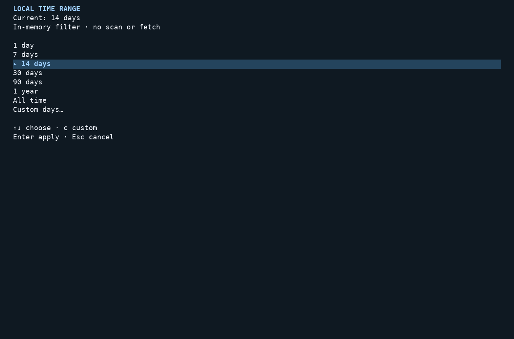

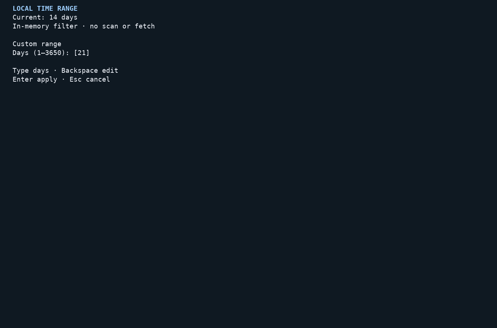

## Compact list → detail

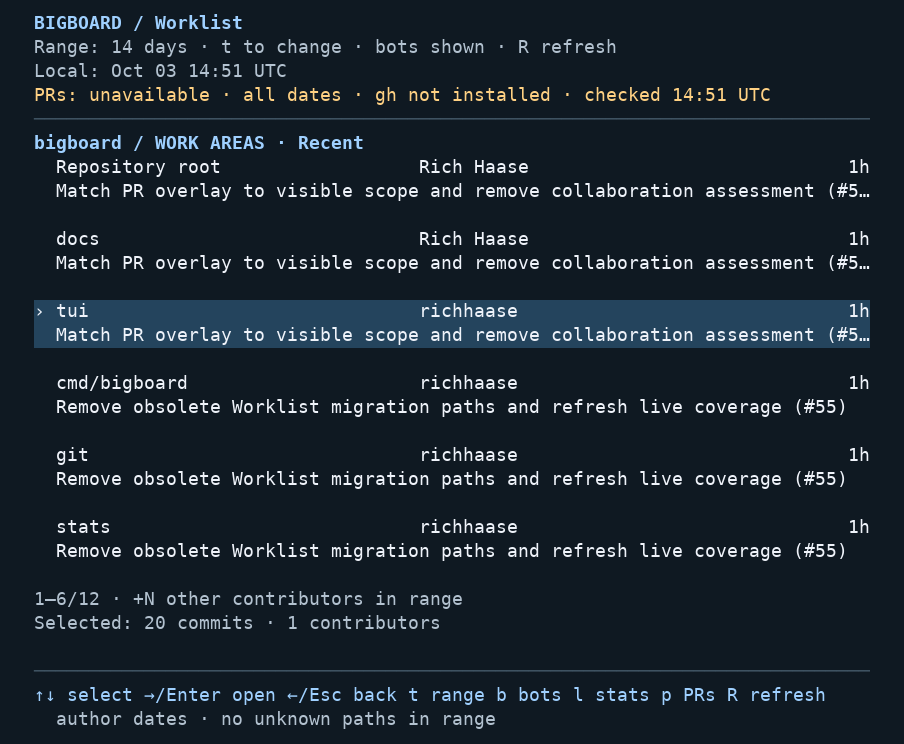

*Compact overview, 80 × 30. Six areas fit on this page. The second line preserves
the concrete commit subject rather than compressing several narrow panels.*

At 80 columns, each item uses two content lines plus spacing. `Enter` replaces
the list with the selected area's evidence; `Esc` restores its selection and
scroll position. `PgUp/PgDown` pages through Worklist lists, and `Home/End`
selects their first/last item.

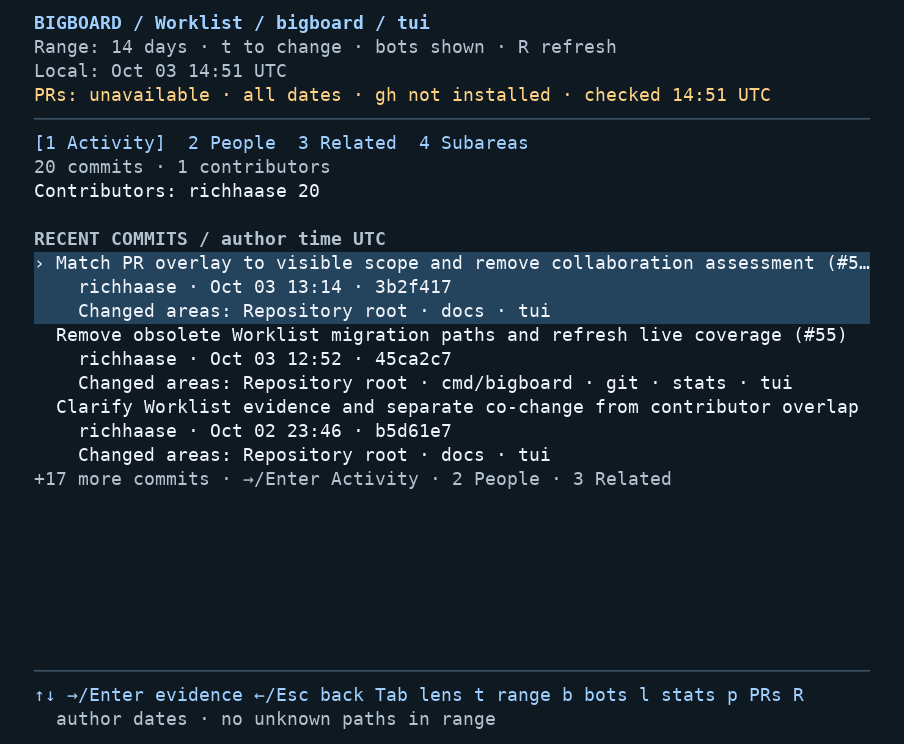

*Activity, 80 × 30. The area list is replaced by commit evidence, with only one
active cursor. `Enter` on the highlighted commit opens the complete subject and
changed-path inspector.*

The wide overview and lower evidence pane start at **110 columns × 28 rows**.
Below either dimension, Worklist uses one primary surface. The minimum supported
size is **40 × 18**:

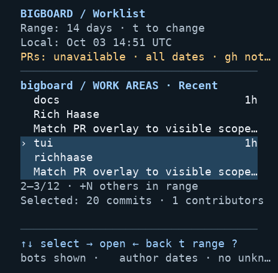

*Small overview, 40 × 18. Each item uses three lines. Long subjects and status
text are visibly truncated; detail and the PR overlay remain available for the
full evidence. The bottom keys stay on screen.*

## People: choose a canonical contributor

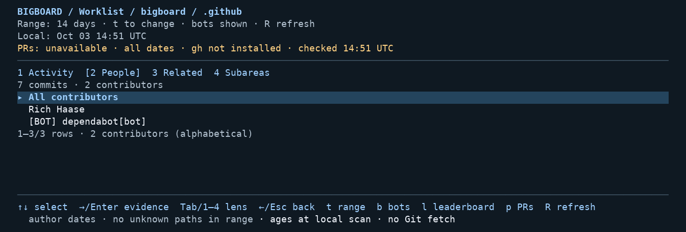

*People, 120 × 18. `.github` has two distinct Git contributors in this range.
“All contributors” is a filter-reset row, not a third contributor.*

Press `2` from an area list or detail to open People. Names are alphabetical;
bots retain their `[BOT]` tag. Identities are based on canonical Git email after
`.mailmap`, with repository-scoped identities when email is missing. Matching
names do not merge people; duplicate display names include distinguishing identity
text. Preview ranking by commit count does not change this alphabetical list.

Select a person and press `Enter` to filter Activity. `Esc` clears that person
filter and returns to People, unless a search must be cleared first. Choosing
“All contributors” also removes the person filter. This local filter never
filters GitHub PRs.

## Related: separate co-change from contributor overlap

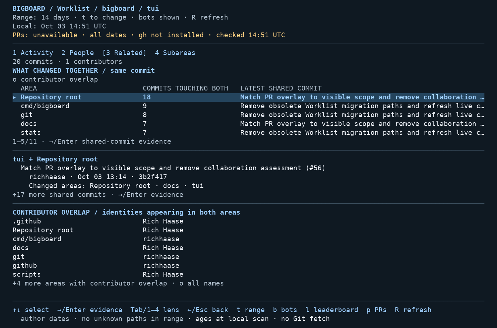

*Related, 120 × 36. The main list counts actual commit IDs present in both areas.
The selected preview shows the latest shared title, author, author time, hash,
and all affected areas.*

Press `3`, select an area, then `Enter` to inspect **only commits touching both**.
`Enter` again opens the canonical full commit and its changed paths. `Esc`
restores the previous selection. Range and bot filters apply; an Activity person
filter does not change the Related inventory. Missing commit IDs never count as
shared evidence.

The separate **Contributor overlap** section names canonical identities present
in both areas in the selected range. Press `o` for
the full scrollable overlap list, including on narrow terminals; `Enter` opens
its shared names and their identity-filtered Activity. Press `o` again to return
to co-change.

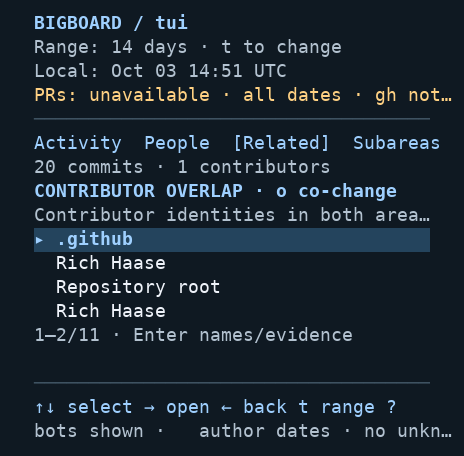

Overlap-only areas do not appear in the shared-commit list.

## Subareas: refine a path group

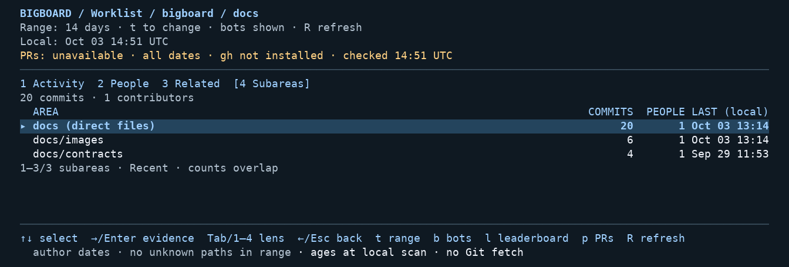

*Subareas, 120 × 18. Direct files are a separate leaf beside child directories.
The historical `docs/contracts` path still appears because selected-range commits
touched it. The counts overlap, so 20 + 6 + 4 is not a repository total.*

Press `4` to refine an automatic area by one literal directory level. `Enter`
on a child opens its evidence and allows further refinement where applicable.
Direct-file leaves do not expand again. Configured named areas preserve their
explicit grouping and do not automatically become directory trees. `s` changes
the Subareas sort, independently of statistics metrics.

When retained PR evidence is available beneath a child, it remains scoped to
the **parent area**, labeled “PARENT AREA PRs”. `p` uses that same parent scope; it does not claim that every
listed PR touches the selected child.

## Inspect a full commit

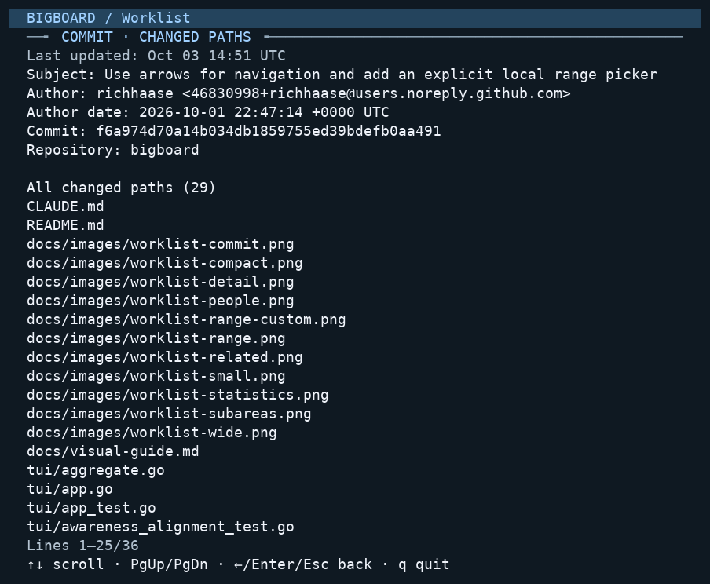

*Commit inspector, 80 × 30. The selected commit changed 29 paths, including files
outside `tui`. The line range shows that more evidence is available below.*

Activity's `Enter` opens the canonical full commit, not only paths assigned to
the selected area. Long subjects, author identities and paths wrap by terminal
cells. Rename/copy origins and generated-file exclusions are labeled when present.

`↑/↓` scrolls lines. `PgUp/PgDown` or `Home/End` moves farther.
`Enter` or `Esc` returns to Activity; `Tab/Shift+Tab` leaves for the next/previous
lens. Return to a list or lens before changing filters or refreshing. The
inspector's “Last updated” is the same retained local scan time called “Local” in
Worklist. A refresh that removes the commit cannot silently retarget this
inspector to a different commit.

## Local and PR freshness are separate

**Local** is the last successful scan for the selected repository. A failed scan
retains previous evidence with **STALE** shown before the name. **Updating…**
keeps the current view usable during a refresh. `e` opens scan-error details when
present; that overlay supports scrolling and `R` to retry.

**PRs** describes the selected repository's independent all-open snapshot. A
failed or incomplete request remains **STALE**, **PARTIAL**, or **unavailable**.
Shared unavailability appears only in the header; no per-area unknown column
competes with commit titles. Retained area-specific PR signals remain visible.
“Checked” is an attempt time. Retained evidence also reports its last complete
fetch when known and space permits. Unknown inventory is never shown as zero;
`p` provides detailed status and any remote retry/cooldown time.

From Worklist, `p` opens the highlighted repository/parent-area inventory,
including the default first row immediately after entering a repository. An
accepted name search changes that visible scope; no matching rows means no
scoped PRs. `P` opens all included repositories regardless of that search. PRs use **all open dates**, independent of local
range, bot, person, and commit-search filters. Inside the overlay, `p` selects the current scope and `P` selects all included
repositories, returning to the first list row without fetching. `Enter` toggles
detail, `↑/↓` scrolls, and `Esc` backs out one level. `R` there refreshes
**PRs only**; it does not start a local Git scan. `o` opens the selected PR in
your default browser from the PR list or detail. The hint appears only for a
valid GitHub PR URL; launch errors appear in the overlay.

GitHub context uses an already installed and authenticated `gh` CLI. Bigboard
never signs in, requests new access, or fetches Git objects. Local history loads
on launch and on `R` from Worklist, the statistics leaderboard, or scan errors.
Remote requests use existing API budgets and cooldowns. **There is no timer
refresh, polling, or automatic retry.** Update cached remote Git history yourself
when needed; Bigboard only reads the local cache.

## Contributor statistics

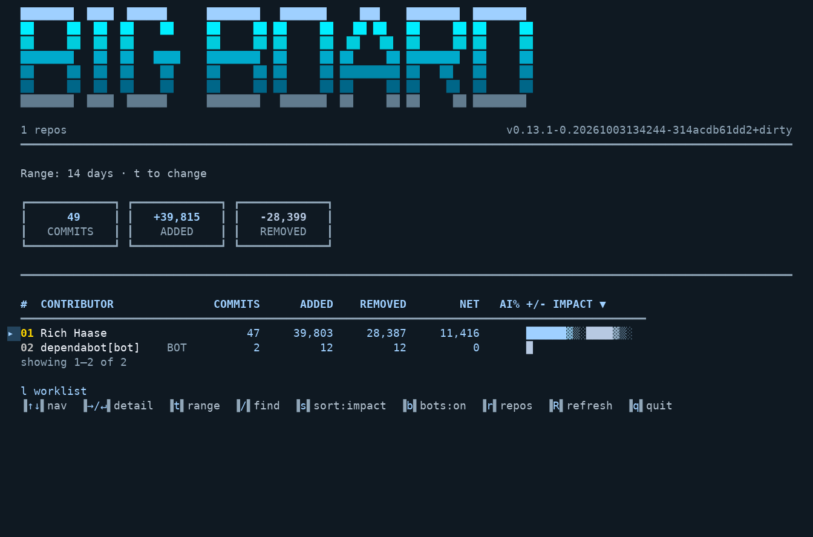

*Leaderboard, 120 × 36. Lowercase `l` switches back to Worklist; arrows select and `Enter` opens contributor detail.*

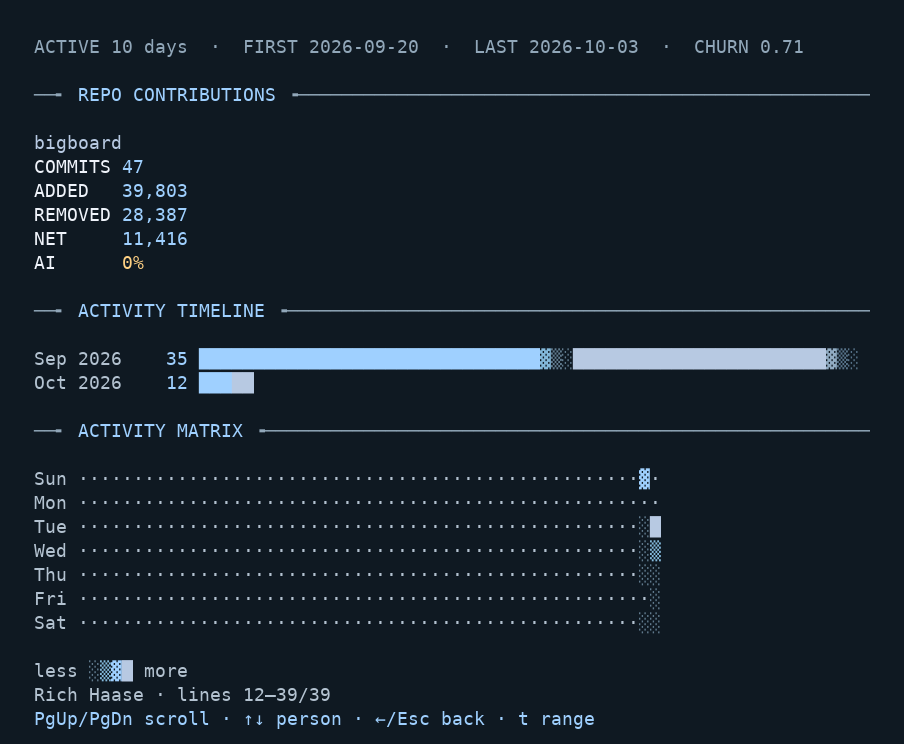

*Contributor detail, 80 × 30, after paging down. Repository values are labeled
rather than squeezed into columns. The footer identifies Rich Haase and shows
lines 12–39/39, while paging and back controls remain visible.*

From Worklist, lowercase `l` opens the statistics leaderboard and `Enter` opens
a contributor.
In detail, `PgUp/PgDown` scrolls, `Home/End` jumps to an edge, and `↑/↓` switches
contributors. `Esc` returns to the leaderboard; press `l` **there** to return to
Worklist. Both statistics views use `t` for the local range. `→` opens the
selected contributor, `←` returns, and `←` at the leaderboard stays there.

Sorting (`s/S`), name search (`/`), bot toggles (`b`), repository controls (`r`),
and refresh (`R`) live on the statistics leaderboard. Worklist's PR and lens keys
do not apply to statistics. See the [view-specific controls](../README.md#controls)
for search, quit, and overlay behavior.

## Keyboard help

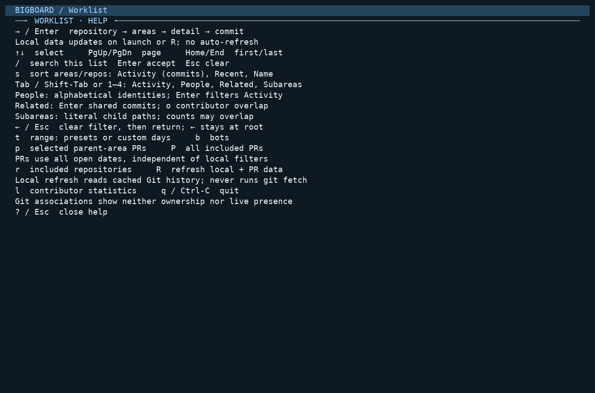

*Help, 120 × 36. `?` opens these controls from Worklist. Navigation uses arrows,
`Enter/Esc`, and the page/edge keys shown here; `l` opens the leaderboard.*

## Capture details

All fourteen images were captured on October 3, 2026 with the current keyboard
controls and indented commit metadata, scanning public Bigboard history at
[3b2f417](https://github.com/richhaase/bigboard/commit/3b2f417bba9864b590e7201eeb006ff8495b4ff4)
in an isolated local clone named `bigboard`. The capture config sets `since` to
`14d`; bots remain shown. Images are rendered from actual PTY cell buffers, with
Git on PATH and `gh` omitted, so “gh not installed” is real and no GitHub request
is made. Timestamps use **UTC**. Counts and ages describe that retained snapshot.

The opt-in `TestWorklistTerminalCapture` harness separately tests synthetic
Unicode, long-name, 120-contributor and partial-PR states. It is skipped by normal
tests and is not a production mode. **None of this guide's screenshots uses that
fixture.**
