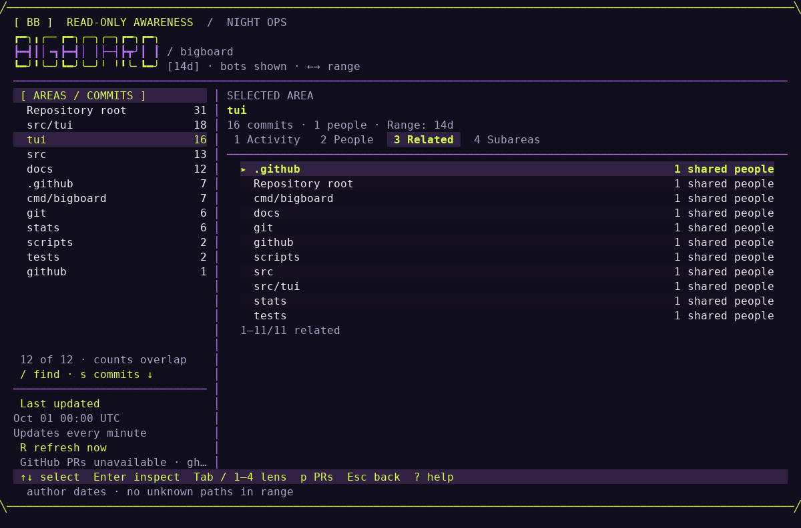
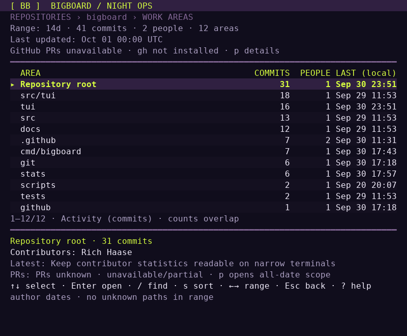
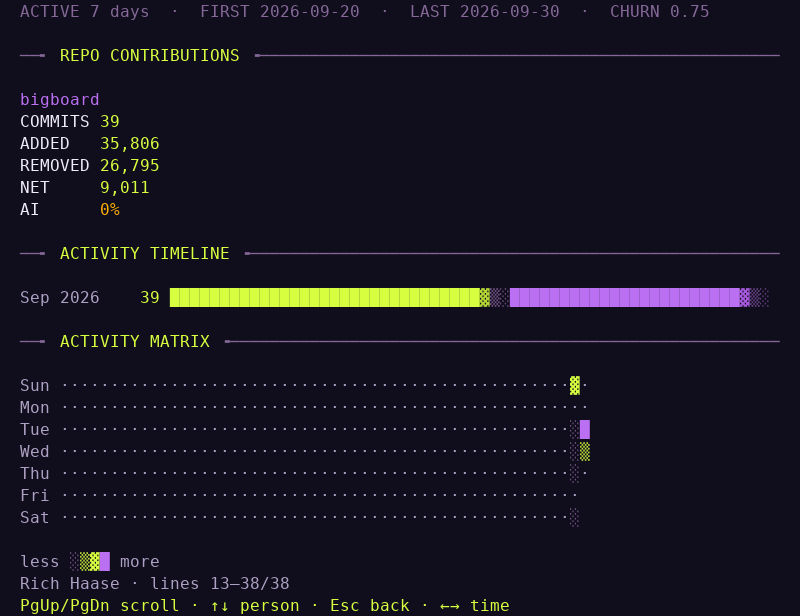

# Night Ops visual guide

[Back to the README](../README.md)

Bigboard starts with **work relationships**: repositories, path-based work areas,
people, and the commit evidence connecting them. Run `bigboard ~/src/` to discover
repositories, or `bigboard /path/to/repo` for one repository. A single included
repository opens directly into its work areas.

These screenshots are real terminal captures of Bigboard's public repository,
not mockups. They use the default **14d** range with bots shown. Historical areas
such as `src/tui` can remain visible even when those paths no longer exist in the
current checkout. The Activity and Related captures predate the manual-refresh
change: their “Updates every minute” status is historical. Current Bigboard
refreshes only on launch or `R`.

## Explore an area

*Activity, 120 × 36. The left inventory keeps the repository's work areas in view;
the right pane shows evidence for `tui`. The highlighted commit is ready to inspect.*

- Use `↑/↓` or `j/k` to choose a repository, then `Enter` to open its areas.
  Choose an area and press `Enter` again to focus its Activity lens
- Press `Enter` on a commit for its full subject, contributor identity, timestamp,
  object ID, and changed paths. `Esc` returns to the previous view
- **Who worked here** is ranked by commits in the selected scope and time range,
  with the current bot filter applied. `+N more` means the preview is bounded;
  press `2` for the full alphabetical People list
- `←/→` changes the time range; `s` changes the inventory sort between Activity,
  Recent, and Name. `/` searches the current list

The sidebar counts and selected-area counts describe **commits**, not priority,
productivity, or ownership. A commit can touch several areas, so those counts
overlap and must not be added together.

## Follow the relationships

*Related, 120 × 36. Each `1 shared people` label means one canonical Git contributor
appears in both areas under the current filters. It does not mean one shared commit.*

Press `3` to open Related, then `Enter` on an area to inspect the shared identities
and their commit evidence. This is a historical association, not evidence that
people are online or collaborating. Shared Git history across clones or forks can
also create associations.

Use `Tab` / `Shift+Tab` or `1`–`4` to switch lenses:

1. **Activity:** commits and their author-date evidence
2. **People:** alphabetical contributors; `Enter` filters Activity to that person
3. **Related:** areas connected by shared contributors
4. **Subareas:** one more literal directory level, with direct files as a separate
   leaf. Named, configured work areas retain their explicit definitions

`Esc` returns through the levels. If a search is active, it clears the search first.

## Work in a smaller terminal

*Compact overview, 80 × 30. The same work areas become one primary list with a
selected-area preview underneath. Numeric context stays visible without squeezing
all the wide panels onto the screen.*

The split workspace starts at **100 columns × 28 rows**. Below either dimension,
the compact view uses the same navigation and detail lenses. The minimum terminal
size is **40 × 18**. Press `?` in the awareness views for the full controls.

## Inspect contributor statistics

*Contributor detail, 80 × 28, scrolled down. Repository metrics switch to labeled
rows, followed by the timeline and activity matrix. The bottom line keeps paging
and back navigation available.*

Press `v` from relationships to open the statistics leaderboard, then `Enter` on
a contributor. `PgUp` / `PgDown` scroll the detail; `Home` / `End` jump to the first
or last page. `↑/↓` switches contributors rather than scrolling. `Esc` returns to
the leaderboard; `v` returns to relationships.

## Read freshness and PR status separately

**Last updated** is the last successful local scan for the selected repository.
The board refreshes local data on launch and when you press `R`; it does not
auto-refresh. **Updating…** keeps the existing view usable during a refresh.
A failed refresh retains last-good data and marks it **STALE**. Bigboard never runs
`git fetch`: update the local Git history separately when needed.

GitHub PR context loads automatically when a supported GitHub origin and an
already authenticated `gh` CLI are available. These captures were made in a
minimal terminal environment without `gh`, so the app truthfully shows
**PRs unknown** and **gh not installed** while local history remains usable.

Press `p` for PRs in the selected scope or `P` for all included repositories.
PRs cover **all dates**, independently of the local time, person, and bot filters;
they never contribute to commit counts. **STALE**, **PARTIAL**, and **UNKNOWN**
qualify evidence rather than indicating approval or merge readiness. `R` refreshes
local history and PR context; inside the PR overlay it refreshes PRs only.

See [accuracy notes](../README.md#accuracy-notes),
[PR context and limits](../README.md#automatic-github-pr-awareness), and the
[complete controls](../README.md#controls).

### Capture details

Captured on October 1, 2026 in UTC from the executable built at
[`518f9a7`](https://github.com/richhaase/bigboard/commit/518f9a763454a0045fc7ad5b7ad971eefc02c42e),
using a full local copy of the public repository at the same commit. The PNGs
render the running application's ANSI terminal output cell by cell, preserving
its text, colors, and layout, with DejaVu Sans Mono. No UI labels, counts, or
statuses were edited. Terminal dimensions are listed in each caption; timestamps
and counts will naturally differ in later runs.
